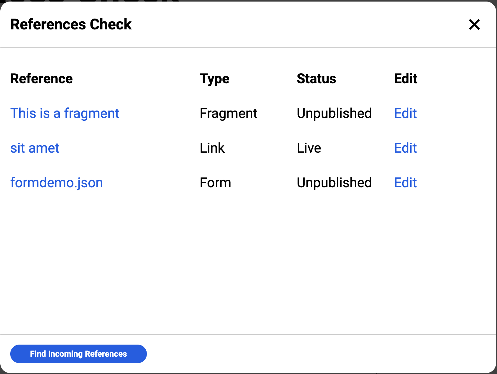

# AEM References Check Sidekick Plugin

This block is used by the references sidekick plugin to check for page references (forms, fragments, links, etc.). Injecting it into the page is based on the sidekick event model, see [`initSidekick`](../../scripts/scripts.js#L197) in `script.js`.

## How it Works

Forms and fragments are discovered based on data attributes, which are rendered by those respective blocks. You may need to update the form/fragment blocks in your project for this to work, see [here](../fragment/fragment.js#L50) and [here](../form/form.js#L94). Links are discovered using a domain check, so any link in the DOM to hlx.page, hlx.live, or a production domain, will be included. This logic is included in [`utils.js`](../../scripts/utils.js#L37)

Once a reference is discovered, an admin api call is triggerred to get it's edit link and publish status. In addition, for fragment references, the document is fetched to get it's title.

### Incoming References

Finding incoming references relies on a special query index with a `links` property containing an aray of all the links in the page. See [helix-query.yaml](../../helix-query.yaml#L32) for how this index is defined.