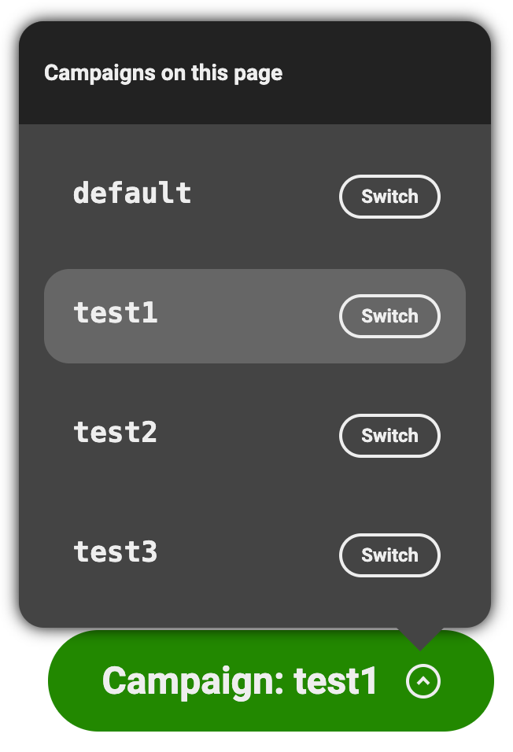

With campaigns you can send out emails or social media posts that link back to your site and that will serve specific offers or versions of your content to the targeted audience.

## Set up

The set up is pretty minimal. Once you've instrumented the experimentation plugin in your AEM website, you are essentially good to go.

Just keep in mind that if you want to only target specific audiences for that campaign, you'll also need to set up the [audiences](Audiences) accordingly for your project.

### Custom options

By default, the campaigns feature looks at the `Campaign` metadata tags and `campaign` query parameter, but if this clashes with your existing codebase or doesn't feel intuitive to your authors, you can adjust this by passing new options to the plugin.

For instance, here is an alternate configuration that would use `sale` instead of `campaign`:
```js
const { loadEager } = await import('../plugins/experimentation/src/index.js');
await loadEager(document, {
  campaignsMetaTagPrefix: 'sale',
  campaignsQueryParameter: 'sale',
}, /* plugin execution context */);
```

:mega: The campaign feature also supports the industry-standard Urchin Tracking Module (UTM) `utm_campaign` as query parameter. There is nothing special you need to do to get this working and it will be seamlessly handled the same way as the `campaignsQueryParameter`. This means that both:

- [https://{ref}--{repo}--{org}.hlx.page/my-page?campaign=xmas]()
- [https://{ref}--{repo}--{org}.hlx.page/my-page?utm_campaign=xmas]()

would essentially serve you the `xmas` variant of the experience.

## Authoring

Once the above steps are done, your authors are ready to start using campaigns for their experiences.
This is done directly in the page metadata block:

| Metadata            |                                                                 |
|---------------------|-----------------------------------------------------------------|
| Campaign: Xmas      | [https://{ref}--{repo}--{org}.hlx.page/my-page-for-xmas]()      |
| Campaign: Halloween | [https://{ref}--{repo}--{org}.hlx.page/my-page-for-halloween]() |

The notation is pretty flexible and authors can also use `Campaign (Xmas)` or `Campaign Halloween` if this is a preferred notation.

If you wanted to additionally restrict the campaign to specific audiences, so that for instance your campaigns are only accessible on mobile phone or on iPhone, you'd leverage the [audiences](Audiences) feature and use the following metadata:

| Metadata            |                                                                 |
|---------------------|-----------------------------------------------------------------|
| Campaign: Xmas      | [https://{ref}--{repo}--{org}.hlx.page/my-page-for-xmas]()      |
| Campaign: Halloween | [https://{ref}--{repo}--{org}.hlx.page/my-page-for-halloween]() |
| Campaign Audience   | mobile, iphone                                                  |

If any of the listed audiences is resolved, then the campaign will run and the matching content will be served.
If you needed both audiences to be resolved, you'd define a new `mobile-iphone` audience in your project and use that in the metadata instead.

### Simulation

Once all of this is set up, authors will have access to an overlay on `localhost` and on the stage environments (i.e. `*.hlx.stage`) that lets them see what campaigns have been configured for the page and switch between each to visualize the content variations accordingly.



## Development

To help developers in designing variants for each campaign, when a campaign is resolved on the page it will automatically add a new CSS class named `campaign-<name of the campaign>` to the `<body>` element, i.e. `campaign-xmas`.
