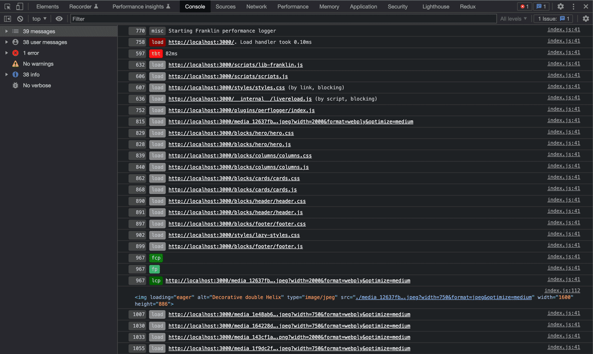

# franklin-plugin-perflogger
A performance logger plugin for Franklin that will output key performance metrics (core web vitals and a few others) to console. It is meant to be used with this forked [Franklin Project Boilerplate](https://github.com/ramboz/helix-project-boilerplate) that includes a plugin system.

The performance logger won't be as accurate as proper solutions like https://pagespeed.web.dev/ or other services that can report stable lab data, or realistic field metrics, but it does help highlight key improvement areas during development.



## Install

### Via the boilerplate

```bash
npm run franklin:plugin:add --name=perflogger --url=git@github.com:ramboz/franklin-plugin-perflogger.git
```

You can then later update it from the source again via:
```bash
npm run franklin:plugin:update --name=perflogger
```

### Manually

```bash
git subtree add --squash --prefix plugins/perflogger git@github.com:ramboz/franklin-plugin-perflogger.git main
```

You can then later update it from the source again via:
```bash
git subtree pull --squash --prefix plugins/perflogger git@github.com:ramboz/franklin-plugin-perflogger.git main
```

## Usage

### Via the plugin system

The easiest is to load the plugin via the `withPlugin` method provided in this forked [Franklin Project Boilerplate](https://github.com/ramboz/helix-project-boilerplate).

```js
import { withPlugin } from './lib-franklin.js';

...

await withPlugin('/plugins/perflogger/index.js', {
  condition: () => window.location.hostname === 'localhost' || window.location.origin.endsWith('.hlx.page')
});
```

### Manually

Alternatively, you can also just directly use this as:

```js
if (window.location.hostname === 'localhost' || window.location.origin.endsWith('.hlx.page')) {
  const logger = await import('/plugins/perflogger/index.js');
  logger.init(options);
}
```

by making sure you place the `init` call as close to the beginning of your script as possible, so you don't miss the events that are tracked.

## Configuration

| Name | Default | Type | Description |
|-|-|-|-|
| `cls` | `true` | `boolean` | Tracks _cumulative layout shifts_ events
| `dcl` | `true` | `boolean` | Tracks the `DOMContentLoaded` and `load` events
| `fcp` | `true` | `boolean` | Tracks the _first contentful paint_ event
| `fid` | `true` | `boolean` | Tracks the _first input delay_ event
| `fp`  | `true` | `boolean` | Tracks the _first paint_ event
| `lcp` | `true` | `boolean` | Tracks the _largest contentful paint_ event
| `tbt` | `true` | `boolean` | Tracks the _long tasks_ events contributing to the _total blocking time_
| `resources` | `true` | `boolean` | Tracks the `load` event for each resource
| `debug` | `false` | `boolean` | Logs more fine-grained details for every event

You'd use those as follows:
```js
await withPlugin('/plugins/perflogger/index.js', {
  debug: true,
  cls: true,
  dcl: true,
  fcp: true,
  fid: true,
  fp: true,
  lcp: true,
  resources: true,
  tbt: true,
});
```
